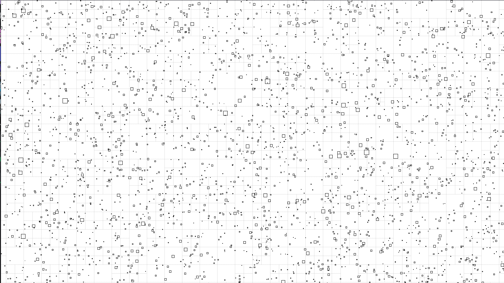

This is a pretty efficient 2D C Quadtree that does not use any recursion.

On my PC at least, it handles 100k entities of varying sizes at, well, something resembling 60FPS. Here's a screenshot of the simulation (that you can run yourself if you keep reading down):



Some steps for rookies:

1. Create a `QUADTREE Quadtree` object and call `QuadtreeInit(&Quadtree)` on it. Call `QuadtreeFree(&Quadtree)` to free it after you're done using it.

2. Set its `Quadtree.Query`, `Quadtree.NodeQuery`, `Quadtree.Collide`, `Quadtree.IsColliding`, and `Quadtree.Update` callbacks as you wish.

	`Quadtree.Query` will be called once per any intersecting element.

	`Quadtree.NodeQuery` will be called once per any leaf node.

	`Quadtree.Collide` will only be called once per one collision.

	`Quadtree.IsColliding` will be called a lot of times to check if 2 entities collide, and might not be followed by a `Quadtree.Collide` even if it returns a non zero number. Return zero if not colliding.

	`Quadtree.Update` will be called once for every entity you inserted.

3. Set the core constants `Quadtree.X`, `Quadtree.Y`, `Quadtree.W`, `Quadtree.H`, and `Quadtree.MinSize`.

	Quadtree positions can be negative, yes.

	`Quadtree.MinSize` - the limit on how small cells may be. It applies to both width and height.

4. Call `EntityIdx = QuadtreeInsert(&Quadtree, Entity)` to insert new entities, and `QuadtreeRemove(&Quadtree, EntityIdx)` to remove them.

	You (should/must) use the return value (EntityIdx) to order your own entity-associated data, like so:

	```c
	typedef struct ENTITY
	{
		float VX, VY;
	}
	ENTITY;

	ENTITY Entities[MAX_ENTITIES];

	void
	InsertEntity(
		QUADTREE* Quadtree,
		const QUADTREE_ENTITY* QTEntity
		)
	{
		uint32_t EntityIdx = QuadtreeInsert(Quadtree, QTEntity);
		Entities[EntityIdx] = { /* Some init here */ };
	}
	```

	This way, you can access your own data easily when any Quadtree callbacks are called (and they all receive EntityIdx'es). You don't pass any reference number along with the entity you insert. This works for me, and might not work for you, which is fine. I wrote this Quadtree for my own use anyway.

	The entity indexes start from 1, but for performance reasons you probably shouldn't keep subtracting and adding 1 to your entity indexes all the time.

	You can't call `QuadtreeRemove()` from pretty much any callbacks.

5. Call the remainder of the functions:

	`QuadtreeQuery(&Quadtree, X, Y, W, H)` calls `Quadtree.Query` on all entities in range.

	`QuadtreeQueryNodes(&Quadtree, X, Y, W, H)` calls `Quadtree.NodeQuery` on all leaf nodes in range.

	`QuadtreeUpdate(&Quadtree)` calls `Quadtree.Update` on every entity in the Quadtree. It does a lot of things behind the back to ensure the tree is balanced and keeps good performance. It does a few memory allocations.

	`QuadtreeCollide(&Quadtree)` calls `Quadtree.Collide` on any colliding items. It automatically dedupes collisions, however you can set `QUADTREE_DEDUPE_COLLISIONS` in `quadtree.h` to zero if you don't want that, however you should know that not deduping collisions means not only that you can collide with the same entity once, but AT LEAST twice if a collision occurs at all. Deduping gets rid of that extra one time so that you only get one call to `Quadtree.Collide`.

6. Useful constants

	If your simulation does A LOT of collisions every tick, it might be a good idea (performance-wise) to increase the value of the macro `QUADTREE_HASH_TABLE_FACTOR`. By default its 1, and depending on whatever ridiculous number of collisions you can come up with, you might need to increase it a few times up to even 20. Note that it will only change anything if `QUADTREE_DEDUPE_COLLISIONS` is set to 1 (which is the default).

	If you feature an insanely big map size and/or you set `Quadtree.MinSize` ridiculously low, you might need to increase `QUADTREE_MAX_DEPTH`, which is 20 by default. Increasing it doesn't really budge memory usage at all, just some increased stack usage of Quadtree functions by a few bytes per one addition.

	`QUADTREE_SPLIT_THRESHOLD` controls how many entities a leaf node may hold at maximum. If the node can split (its divided width and height being greater than `Quadtree.MinSize`) and one more entity tries to insert itself into the node, the node will be split.

7. Useful information

	This quadtree implementation features not only lazy node merging, but also lazy merging itself, meaning a node might not merge even if the sum of deduped entities in child nodes is less or equal to `QUADTREE_SPLIT_THRESHOLD`.

	Nodes are not guarded against the pathological case of infinite splitting, so if your `QUADTREE_SPLIT_THRESHOLD` is 1, and you insert 2 entities that are both bigger than the quadtree, the quadtree will split all of its nodes until it hits the rock bottom. There are currently no algorithms employed that guard against nodes splitting when under the weight of entities bigger than the nodes. There were attempts to add such protection, but it would result in much greater code complexity as well as decreased performance, which isn't really a good tradeoff. At least I know I won't be using the quadtree to frantically overlap entities all the time.

8. Benchmarks

	You need a Linux distro (sorry not sorry). Simply run `make` for a normal build, or `make profile` to first run a profiling build and then run and profiled build (which ought to be faster than the profiling one). For the profiling to work correctly, you need to close the simulation window. If you interrupt the program in the terminal, the whole command will halt along with make.
