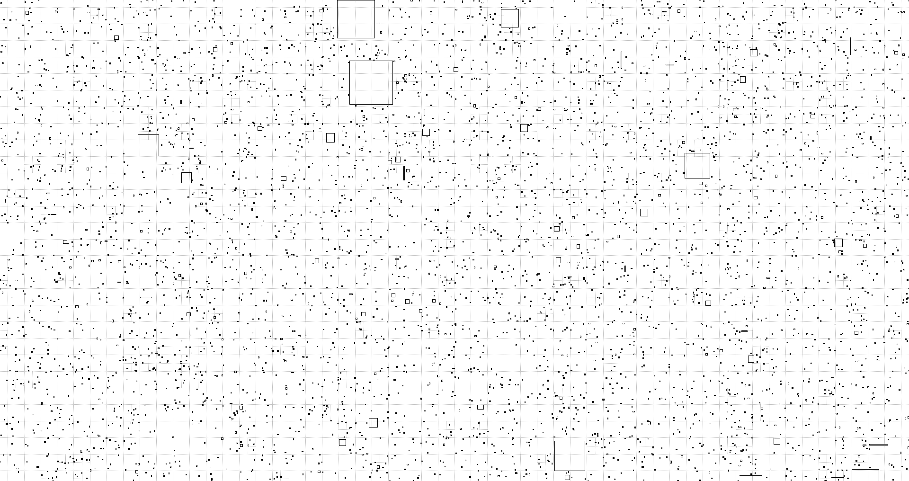

This is a very efficient C Quadtree that does not use any recursion.

On my laptop at least, it handles 400,000 entities of wildly varying sizes at around 17.5mspt, with 1,000x 1920x1080 (roughly) queries taking around 0.26mspt. Here's a fraction of the simulation:

If you want to run the simulation yourself, just execute `make`. Naturally, the time figures given are only for demonstrative purposes only, as they can vary.

For similar settings to my [HSHG](https://github.com/supahero1/hshg) (500k same sized entities and other parameters), it yields around 15.2mspt, beating it by ~15%. Finally I'm able to say hierarchical structures rock the game when written properly.

Made for my private use, but it doesn't take a genius to start using this by yourself.
